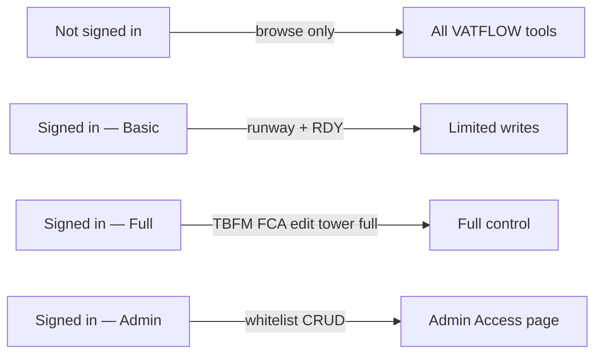

# VATFLOW — Access, Permissions & Admin Guide

Personal reference for how sign-in, permissions, and admin tools work after VATSIM Connect OAuth.

**Live site:** [https://vatflow.io](https://vatflow.io)  
**Admin page:** [https://vatflow.io/admin-access.html](https://vatflow.io/admin-access.html)  
**Auth backend:** Railway hub (`vatflow-hub-production.up.railway.app`)

---

## The big picture



1. User clicks **Sign in with VATSIM** → VATSIM Connect verifies identity.
2. Railway hub exchanges the OAuth code and issues a **short-lived JWT** (~8 hours).
3. JWT is stored in the browser. Every tool reads it to decide what the user can do.
4. **Full access** is granted automatically for **C1+** or manually via your **whitelist**.
5. **Admin** is separate: only CIDs listed in Railway `VATFLOW_ADMIN_CIDS` can manage the whitelist.

There are **no passwords** anymore. The old bootstrap admin password and per-page passwords are gone.

---

## The four access levels

| Level | How you get it | Nav shows |
|---|---|---|
| **Visitor** | Don't sign in | **Sign in with VATSIM** button |
| **Basic** | Sign in with any VATSIM account | CID · rating, status **Signed in** |
| **Full** | Sign in as C1+ **or** whitelisted CID | CID · rating, status **Controller** |
| **Admin** | Your CID in `VATFLOW_ADMIN_CIDS` on Railway | Same as above + **Admin Access** link visible |

### What “full access” means on the server

At sign-in, the hub checks:

```
fullAccess = (controller rating ID ≥ 5)  OR  (CID is on whitelist)
```

| Rating ID | Short | Full access by rating? |
|---:|---|---|
| 1 | OBS | No |
| 2 | S1 | No |
| 3 | S2 | No |
| 4 | S3 | No |
| **5** | **C1** | **Yes** |
| 6+ | C2, C3, I1, I2, I3, SUP, ADM | Yes |

Whitelist overrides rating: an S3 on the whitelist gets full access. A C1 **not** on any blocklist always gets full access.

**Note:** Removing someone from the whitelist does **not** kick them out instantly. Their JWT was already issued with `fullAccess: true` and stays valid until it **expires (~8 hours)** or they **sign out** and sign in again. Plan revocations accordingly.

---

## What each person can do (by tool)

### Visitor (not signed in)

- View live VATSIM feed and all tool UIs in **read-only** mode.
- Cannot edit runways, FCAs, TBFM programs, hub state, or press RDY.

### Basic (signed in, not full)

| Tool | Can do | Cannot do |
|---|---|---|
| **Runway Balancer** | Full edit (runways, STAR rules, configs) | — |
| **FCA Builder** | Press **RDY** / cancel releases on existing FCAs | Create, edit, delete, or draw FCAs; reorder sequence |
| **Tower Departures** | **RDY** only if online on a VATSIM controller position (feed check) | Reorder strips, PIN/HIDE, full sequencing |
| **CFR / TBFM** | View everything | Set rates, CFRs, restrictions, ground stops, hub writes |
| **Hub sync (TBFM)** | Receive live state | Push changes to hub |

### Full (signed in + C1+ or whitelist)

Everything Basic can do, **plus**:

| Tool | Extra capabilities |
|---|---|
| **FCA Builder** | Create/edit/delete FCAs, draw areas, reorder, import/export |
| **Tower Departures** | Full sequencing, drag-reorder, PIN/HIDE |
| **CFR / TBFM** | All TMU controls, taxi monitor field edits, hub push |
| **Hub sync** | WebSocket writes accepted by Railway |

### Admin (you)

- Everything Full can do.
- **Admin Access** page: add/remove CIDs on the whitelist.
- Admin link is **hidden** from everyone else in the nav.

---

## Tower Departures — RDY rules (special case)

Tower has three modes:

| Mode | Condition |
|---|---|
| View only | Not signed in |
| **RDY only** | Signed in + **currently online** on a VATSIM controller position (verified via live feed) + **not** full tier |
| **Full control** | Full tier (C1+ or whitelist) |

CID comes from VATSIM OAuth automatically (no manual CID box). The feed re-checks every ~20 seconds whether they are still on position.

---

## Sign-in flow (what happens technically)

1. User on `vatflow.io` clicks **Sign in with VATSIM**.
2. Browser goes to Railway: `/auth/vatsim/login?returnTo=https://vatflow.io/auth-callback.html`
3. Railway redirects to VATSIM Connect.
4. User approves → VATSIM sends them to `https://vatflow.io/auth-callback.html?code=...&state=...`
5. Callback page POSTs code to Railway `/auth/vatsim/exchange`.
6. Hub reads profile from VATSIM (`full_name`, `vatsim_details`), computes tier, signs JWT.
7. JWT saved in browser (`localStorage` key `vatflow.sessionToken.v1`).
8. User redirected back to the page they started from.

**Sign out** clears the JWT locally and tells the hub to revoke that token id.

**Delete my data** (nav, red link): purges server records for that CID (whitelist entry, login audit) and wipes all local VATFLOW settings in the browser. Does **not** delete shared FCA data in Supabase.

---

## Your admin setup (one-time)

### Railway variable

```
VATFLOW_ADMIN_CIDS=1234567
```

- Replace `1234567` with **your** VATSIM CID.
- Multiple admins: comma-separated, no spaces: `1234567,8901234`
- Change requires a Railway redeploy (usually automatic when you save variables).

Only these CIDs get `isAdmin: true` in their JWT and can open the whitelist UI.

### Whitelist storage

Whitelist lives on the Railway **volume** at:

```
/data/vatflow-access.json
```

Shape:

```json
{
  "whitelist": {
    "9876543": {
      "addedAt": "2026-07-10T12:00:00.000Z",
      "addedBy": "1234567",
      "note": "S3 event lead ZDC"
    }
  },
  "loginAudit": { ... },
  "gdprDeleted": { ... }
}
```

Survives hub restarts as long as the volume is attached at `/data`.

---

## Day-to-day admin tasks

### Grant full access to someone below C1

1. Go to [https://vatflow.io/admin-access.html](https://vatflow.io/admin-access.html)
2. **Sign in with VATSIM** (must be your admin CID).
3. Enter their **CID** and an optional **note** (e.g. `S3 TMU KATL event`).
4. Click **Add**.

They get full access the **next time they sign in** (or immediately if they refresh sign-in).

### Revoke whitelist full access

1. Same admin page → **Remove** next to their CID.
2. They lose full access on **next sign-in** or when their current JWT expires (~8 h).

You cannot revoke C1+ full access via whitelist — rating-based access is automatic. (v2 ARTCC scoping is not implemented yet.)

### Check who has full access without whitelist

Anyone with controller rating **C1 or higher** at sign-in. You don't maintain a list for them.

### Add a second admin

Add their CID to `VATFLOW_ADMIN_CIDS` on Railway, redeploy. They sign in again to get admin in the JWT.

---

## What the nav shows users

| State | Nav (right side) |
|---|---|
| Signed out | `Sign in with VATSIM` |
| Basic | `1234567 · S2` `Signed in` `Sign out` `Delete my data` |
| Full | `1234567 · C1` `Controller` `Sign out` `Delete my data` |
| Admin (you) | Same as Full + **Admin Access** link in tool list |

---

## Hub (TBFM sync) enforcement

The only **server-side** write gate for TBFM is the Railway WebSocket hub:

- Clients connect to `wss://vatflow-hub-production.up.railway.app`
- After connect, client sends `{ "type": "auth", "token": "<JWT>" }`
- Hub allows **push** only if JWT has `fullAccess: true`
- Viewers can still connect and receive live state without auth

FCA Supabase sync and most UI gates are still **client-side** today (a determined user could bypass UI; Supabase RLS is a future hardening step).

---

## Railway variables cheat sheet

| Variable | Purpose |
|---|---|
| `VATSIM_CLIENT_ID` | From VATSIM Connect |
| `VATSIM_CLIENT_SECRET` | From VATSIM Connect |
| `VATSIM_REDIRECT_URI` | `https://vatflow.io/auth-callback.html` |
| `VATFLOW_DEFAULT_RETURN_URL` | `https://vatflow.io/auth-callback.html` |
| `VATFLOW_ALLOWED_RETURN_HOSTS` | `vatflow.io,www.vatflow.io,djbrombizzle.github.io` |
| `JWT_SIGNING_KEY` | Random secret — signs session tokens |
| `VATFLOW_ADMIN_CIDS` | **Your** CID(s) — who can use Admin Access |
| `ACCESS_FILE` | `/data/vatflow-access.json` — whitelist + audit file |
| `FULL_ACCESS_MIN_RATING` | Optional; default `5` (C1) |

---

## Quick troubleshooting

| Symptom | Likely cause |
|---|---|
| No **Sign in** button | Site not deployed with OAuth PR; hard-refresh `vatflow.io` |
| Sign-in fails after VATSIM | Railway vars wrong; check `https://vatflow-hub-production.up.railway.app/auth/config` → `oauthEnabled: true` |
| I'm C1 but see **Signed in** not **Controller** | Rating not returned by VATSIM; sign out/in. Check JWT at `/auth/session` with Bearer token |
| Admin page says not admin | `VATFLOW_ADMIN_CIDS` wrong CID or not redeployed |
| Whitelist add fails | Not signed in as admin, or hub volume not mounted |
| User still has access after whitelist remove | JWT not expired yet — wait or ask them to sign out |
| TBFM changes don't sync | User lacks full tier, or hub auth failed |

---

## What we deliberately did **not** build (v1)

- **ARTCC-scoped** FCA edit limits (e.g. ZDC-only) — deferred to v2
- **Instant** revoke when removing whitelist — JWT is valid until expiry
- **Supabase RLS** tied to JWT — client-side gates only for FCA sync
- Per-page passwords — removed entirely

---

## Related files in the repo

| File | Role |
|---|---|
| [`shared/vatflow-auth.js`](shared/vatflow-auth.js) | Browser session, tier helpers, nav sign-in UI |
| [`auth-callback.html`](auth-callback.html) | OAuth return page on `vatflow.io` |
| [`admin-access.html`](admin-access.html) | Whitelist admin UI |
| [`vatflow-hub/auth.js`](../vatflow-hub/auth.js) | OAuth, JWT, tier logic, whitelist API |
| [`privacy.html`](privacy.html) | User-facing privacy + GDPR delete |

---

*Last updated for VATSIM OAuth v1 (hybrid C1+ / whitelist model).*
