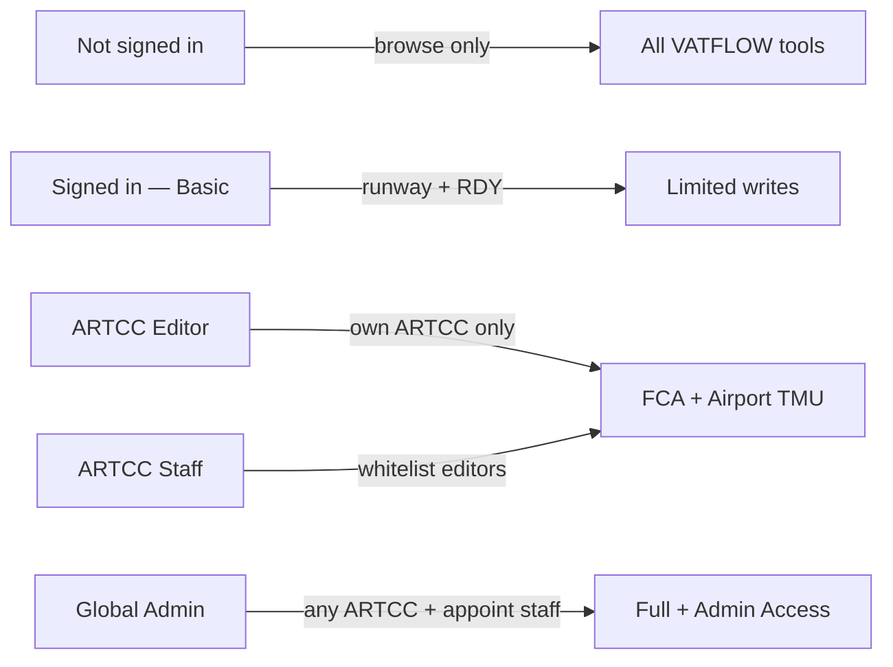

# VATFLOW — Access, Permissions & Admin Guide

Personal reference for how sign-in, permissions, and admin tools work after VATSIM Connect OAuth.

**Live site:** [https://vatflow.io](https://vatflow.io)  
**Admin page:** [https://vatflow.io/admin-access.html](https://vatflow.io/admin-access.html)  
**Auth backend:** Railway hub (`vatflow-hub-production.up.railway.app`)

---

## The big picture



1. User clicks **Sign in with VATSIM** → VATSIM Connect verifies identity.
2. Railway hub exchanges the OAuth code and issues a **short-lived JWT** (~8 hours).
3. JWT is stored in the browser. Every tool reads it to decide what the user can do.
4. **Full access** is granted only via the **whitelist**, now scoped by **ARTCC** (and optional role).
5. **Global admin** is separate: CIDs in Railway `VATFLOW_ADMIN_CIDS`.
6. **ARTCC staff** (appointed by admin) can whitelist editors for their facility without you.

There are **no passwords**. Legacy page passwords are gone.

---

## Access levels

| Level | How you get it | Nav shows |
|---|---|---|
| **Visitor** | Don't sign in | **Sign in with VATSIM** |
| **Basic** | Any VATSIM sign-in | CID · rating, **Signed in** |
| **Editor** | Whitelist `role: editor` + ARTCC(s) | CID · rating, **Controller** or ARTCC codes |
| **Staff** | Whitelist `role: staff` + ARTCC(s) | Same + **Admin Access** link |
| **Global admin** | `VATFLOW_ADMIN_CIDS` | Admin Access + can appoint staff |

### Full access rule

```
fullAccess = (CID is on whitelist)
artccs     = entry.artccs   // e.g. ["ZDC"] or ["*"]
accessRole = entry.role     // "editor" | "staff"
```

Legacy whitelist rows without `role` / `artccs` are treated as **global editors** (`artccs: ["*"]`) until you re-scope them.

`/auth/session` **recomputes** access from the live whitelist on each check, so revokes apply on the next page load / refresh (without waiting for JWT expiry for capability flags).

---

## What each person can do

### Visitor

- View live VATSIM feed and all tool UIs in **read-only** mode.

### Basic (signed in, not whitelisted)

| Tool | Can do | Cannot do |
|---|---|---|
| **Runway Balancer** | Full edit | — |
| **FCA Builder** | **RDY** / cancel releases | Create/edit/delete FCAs |
| **Release Board** | **RDY** if online on VATSIM ATC | Reorder, PIN/HIDE |
| **Airport TMU** | View | Set rates, CFRs via Live sync push, restrictions |

### Editor (whitelisted for ARTCC)

Everything Basic can do, **plus** only for their ARTCC(s):

| Tool | Extra |
|---|---|
| **FCA Builder** | Create/edit/delete FCAs whose owning `artcc` matches |
| **Release Board** | Drag-reorder / PIN/HIDE for owned FCAs |
| **Airport TMU** | Programs / restrictions / ground stops for airports in that ARTCC; Live sync merges scoped pushes |

### Staff

Everything an editor for those ARTCC(s) can do, **plus**:

- Open **Admin Access** and add/remove **editors** for their ARTCC only (cannot appoint other staff or grant `*`).

### Global admin

- Appoint **staff** and **editors** for any ARTCC (or `*` = all ARTCCs).
- Override any facility.

---

## Product map (one job per tool)

| Tool | Purpose |
|---|---|
| **Airport TMU** | Destination capacity — AAR, CFR, restrictions, GS |
| **FCA Builder** | Draw/meter flow constrained areas |
| **Release Board** | Position-facing RDY for active FCAs |
| **Runway Balancer** | Arrival runway demand |
| **vUSAlink** | US CPDLC / datalink |

---

## Ownership rules

### FCAs

- Owning field: `fca.artcc` (required to save for scoped editors).
- `scope` may list other ARTCCs for metering geography; **ACL uses owner only**.

### Airport TMU programs

- Airport → primary ARTCC via a shared map (e.g. KDCA → ZDC).
- Unknown airports: scoped editors cannot edit; global (`*`) can.

---

## Admin Access workflows

### Appoint ZDC staff (you)

1. Open Admin Access as global admin.
2. CID + role **Staff** + check **ZDC** → Add.
3. They sign in again (or refresh) and see Admin Access.

### Staff whitelists a ZDC editor

1. Staff opens Admin Access.
2. Add CID as **Editor** with ZDC checked.
3. That CID can edit ZDC FCAs and ZDC airports only.

### Revoke

Remove on Admin Access. Capabilities update on next `/auth/session` refresh; JWT identity still expires ~8h.

---

## Whitelist storage shape

```json
{
  "whitelist": {
    "9876543": {
      "role": "staff",
      "artccs": ["ZDC"],
      "addedAt": "2026-07-16T12:00:00.000Z",
      "addedBy": "1234567",
      "note": "ZDC TMU"
    },
    "1112223": {
      "role": "editor",
      "artccs": ["ZDC", "ZNY"],
      "addedAt": "...",
      "addedBy": "9876543",
      "note": "Event weekend"
    }
  }
}
```

File: Railway volume `/data/vatflow-access.json` (`ACCESS_FILE`).

---

## Live sync (Airport TMU) enforcement

- Clients connect to `wss://vatflow-hub-production.up.railway.app`
- Auth: `{ "type": "auth", "token": "<JWT>" }` — push requires `fullAccess`
- **Scoped push merge:** rates / restrictions / ground stops for airports outside the caller’s ARTCC are preserved; only owned airports are updated or removed

FCA Supabase writes remain primarily **client-gated** by `canEditFca` (Supabase RLS is a future hardening step).

---

## Railway variables

| Variable | Purpose |
|---|---|
| `VATSIM_CLIENT_ID` / `SECRET` | VATSIM Connect |
| `VATSIM_REDIRECT_URI` | `https://vatflow.io/auth-callback.html` |
| `JWT_SIGNING_KEY` | Session signing |
| `VATFLOW_ADMIN_CIDS` | Global admin CIDs |
| `ACCESS_FILE` | `/data/vatflow-access.json` |
| `JWT_TTL_SEC` | Default 8h |

---

## Related files

| File | Role |
|---|---|
| `shared/vatflow-auth.js` | Session + `canEditFca` / `canEditAirport` |
| `shared/artcc-access.js` | Airport → ARTCC map (browser) |
| `admin-access.html` | Staff / admin whitelist UI |
| `shared/vatflow-help.js` | Quick-reference overlays |
| `vatflow-hub/auth.js` | OAuth, JWT, whitelist API |
| `vatflow-hub/artcc-access.js` | Server ACL helpers |
| `vatflow-hub/server.js` | Live sync WS + scoped merge |

---

*Last updated for ARTCC-scoped staff/editor roles and product clarity renames.*
